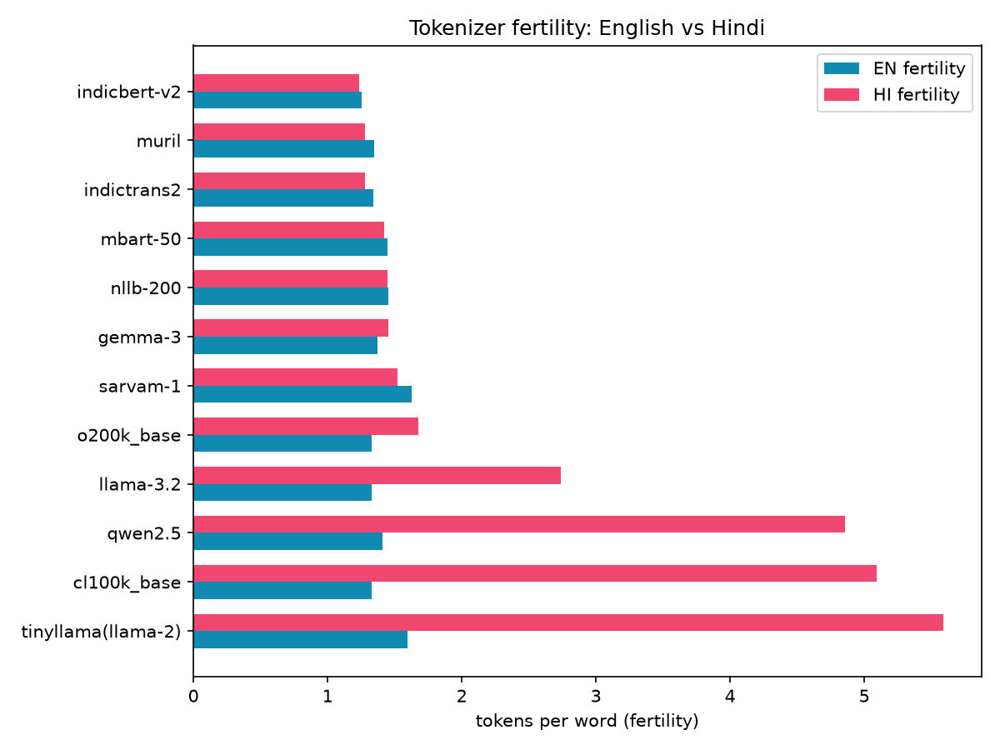
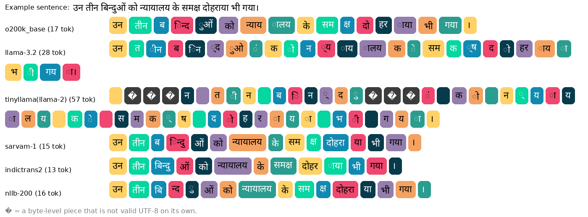
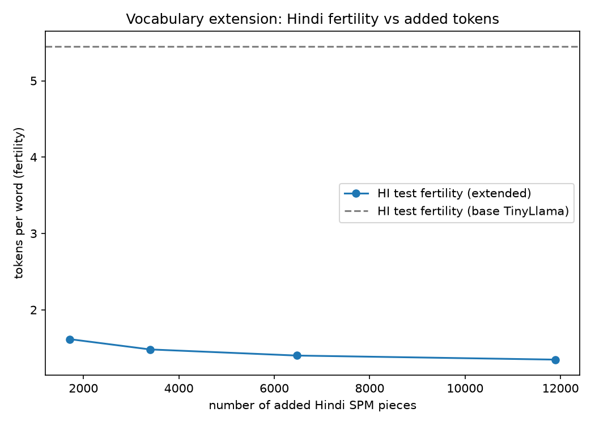

# English → Hindi Translation of Indian Court Judgments: Token Efficiency and LoRA Adaptation

*Prototype-depth report for the Adalat AI ML assignment.* The main body summarises the core work. I have also done
some other things, which are described in the [Appendix](#appendix): recovering five unusable Hindi documents by
OCR, the full 12-tokenizer study and cost table, a vocabulary-extension experiment with an embedding-initialisation
probe, a second LoRA model, full significance tables, an error analysis with counts, training curves, and scaling
and reproducibility notes. The 16 annotated translation examples are in `results/qualitative/examples.md`. Tables
between `<!-- BEGIN/END -->` markers are generated from `results/` by `make report`; numbers in the prose are copied
from those files.

*AI assistance was used to complete this assignment.*

## TL;DR

- **Data.** 30 Supreme Court judgment pairs → 1,431 sentence pairs via LaBSE dynamic-programming alignment (95%
  strict precision on a 20-pair read-through), split 24/3/3 by document. Five Hindi files were unusable (all `?`); I
  recovered them with Tesseract OCR plus digit repair from the PDF text layer (train split only).
- **Tokenizers.** Across 12 tokenizers on the same text, Hindi costs 4.09× the English tokens under GPT-4's
  `cl100k_base`, 2.20× under Llama-3.2 and 1.35× under GPT-4o's `o200k_base`, but only 1.02× under IndicTrans2's own
  vocabulary. Merging 6,475 Devanagari pieces into the Llama-2 tokenizer cuts Hindi fertility by 74% (5.45 → 1.40),
  with mean-initialised embeddings better than random (4.13 vs 6.16 bits/char before training).
- **Model.** IndicTrans2 (a Hindi-efficient vocabulary, so no vocabulary surgery was needed) with LoRA (r = 16,
  attention + FFN), trained on a free Colab T4 in minutes, with early stopping on dev chrF++.
- **Results (test, 120 segments).** IndicTrans2-1B: chrF++ 64.42 → 67.43 (+3.02, p = 0.002), spBLEU +4.16
  (p < 0.001), BLEU-13a +3.02 (not significant), COMET +0.0115 (p = 0.07, not significant). Glossary-term accuracy against
  the reference's rendering: 57.9% → 71.4%. The distilled 200M + LoRA is within noise of the adapted 1B, so it is the
  deployment choice.
- **Caveats.** Part of the string-metric gain is house-style convergence (e.g. अपीलार्थी → अपीलकर्ता, both correct). The
  adapter also learned the references' inconsistencies (प्रत्यर्थी → प्रतिवादी), and degenerate outputs appear in both
  systems. The test set is small and its references are noisy.

---

## 1. Data

All 30 files are **Supreme Court of India** appeals (21 civil, 9 criminal), despite the "HC" label.

- **Preprocessing** (`src/adalat_mt/data/`): unwrap hard-wrapped lines; strip the BOM and zero-width characters;
  targeted OCR fixes (`li.` → `ii.`, spaced Hindi dates); rule-based English/Hindi sentence splitting (including `।`
  with no following space). Legal formatting (paragraph numbers, clause markers, citations, dates) is kept verbatim,
  and a test enforces this.
- **Alignment:** a per-document monotonic dynamic programme over LaBSE embeddings of 1–3-sentence blocks
  (vecalign-style). Paragraph numbers are used only as a soft anchor, because they are not parallel across languages.
  Low-similarity or implausible-length pairs are dropped.
- **Split:** by document, 24/3/3 (1,149 / 162 / 120 pairs), seed 13, ids in `configs/split.yaml`.
- **Quality check:** I read 20 random aligned pairs. 19 were correct and 1 partial, so precision is 0.95 (95% Wilson
  CI 0.764–0.991).
- **Five Hindi files were entirely `?`.** I recovered them from the PDFs by combining Tesseract OCR (for the words)
  with the PDF text layer (for exact digits). This added 226 training pairs, and these documents are used in train
  only. Details: Appendix A.

## 2. Tokenizer analysis and integration strategy

I compared **12 tokenizers on the same train-split text**. *Fertility* = tokens per whitespace-delimited word;
*HI/EN ratio* = Hindi tokens ÷ English tokens on the same parallel pairs (the "Hindi premium").

<!-- BEGIN:tokenizers -->
| tokenizer | family | HI fertility | EN fertility | HI/EN ratio | HI chars/token | HI tok/judgment | % test HI > 256 | cost/judgment USD |
|---|---|---|---|---|---|---|---|---|
| indicbert-v2 | IndicBERT v2 | 1.23 | 1.26 | 1.05 | 3.48 | 2,003 | 0.0% | 0.0247 |
| muril | MuRIL WordPiece | 1.28 | 1.35 | 1.01 | 3.36 | 2,072 | 0.0% | 0.0257 |
| indictrans2 | IndicTrans2 (separate EN/Indic SPM) | 1.28 | 1.34 | 1.02 | 3.35 | 2,080 | 0.0% | 0.0258 |
| mbart-50 | mBART-50 SPM | 1.42 | 1.45 | 1.05 | 3.01 | 2,319 | 0.0% | 0.0285 |
| nllb-200 | NLLB-200 SPM | 1.45 | 1.45 | 1.06 | 2.97 | 2,354 | 0.0% | 0.0289 |
| gemma-3 | Gemma-3 | 1.46 | 1.37 | 1.13 | 2.95 | 2,369 | 0.0% | 0.0288 |
| sarvam-1 | Sarvam-1 (Indic LLM) | 1.52 | 1.63 | 1.00 | 2.82 | 2,476 | 0.0% | 0.0308 |
| o200k_base | GPT-4o (OpenAI) | 1.68 | 1.33 | 1.35 | 2.56 | 2,731 | 0.0% | 0.0322 |
| llama-3.2 | Llama-3 (ungated mirror, identical tokenizer) | 2.74 | 1.33 | 2.20 | 1.57 | 4,436 | 0.0% | 0.0493 |
| qwen2.5 | Qwen2.5 | 4.86 | 1.41 | 3.69 | 0.88 | 7,865 | 14.2% | 0.0838 |
| cl100k_base | GPT-4 / GPT-3.5 (OpenAI) | 5.09 | 1.33 | 4.09 | 0.84 | 8,242 | 15.8% | 0.0873 |
| tinyllama(llama-2) | Llama-2 SPM (32k) | 5.59 | 1.60 | 3.74 | 0.77 | 9,052 | 20.0% | 0.0964 |

*Source: `results/tokenization/summary.json`*
<!-- END:tokenizers -->





- **Indic-aware vocabularies are at parity; general LLM tokenizers are not.** IndicTrans2, MuRIL and IndicBERT-v2
  have an HI/EN ratio of about 1.0, versus 4.09× for `cl100k_base` (GPT-4), 3.74× for Llama-2, 3.69× for Qwen2.5,
  2.20× for Llama-3.2 and 1.35× for `o200k_base` (GPT-4o).
- **In EN→HI the premium lands on the output side.** An average judgment needs 8,242 Hindi tokens under
  `cl100k_base` vs 2,080 under IndicTrans2, so roughly 4× more sequential decoding steps and output-token cost.
- **Truncation:** 15.8% of test Hindi sentences exceed 256 tokens under `cl100k_base`, against 0% under every
  Indic-aware tokenizer.

**Integration strategy.** Use an MT model whose vocabulary is already Hindi-efficient (IndicTrans2, unmodified), and
put the domain adaptation into LoRA weights. Vocabulary surgery pays off only when the base vocabulary is poor, and I
demonstrate that on an LLM. Merging 6,475 Devanagari pieces, from a SentencePiece model trained on the train-split
Hindi, into the Llama-2 (TinyLlama) tokenizer cuts Hindi test fertility from 5.45 to 1.40 (−74%), with English
unchanged. New embedding rows are initialised as the mean of their old sub-token embeddings. On the real TinyLlama
weights, before any training, this is better than random initialisation (4.13 vs 6.16 bits per character).
The full study, the cost table and the extension experiment are in Appendix B.

## 3. Model selection and training approach

- **Model: IndicTrans2** (Gala et al., 2023; MIT licence). It is one of the strongest open EN→Indic models at this size according to its paper, its
  vocabulary is at parity (§2), the 1B model fits a free Colab T4 with LoRA, and the distilled 200M model runs on CPU.
- **Baselines** (zero-shot): IndicTrans2-1B (the "before" system), IndicTrans2-dist-200M, and NLLB-200-distilled-600M
  (a second model family).
- **LoRA:** rank 16, α 32, dropout 0.1, on attention (q/k/v/out) and feed-forward (fc1/fc2) layers of both encoder
  and decoder. lr 3e-4, effective batch 16, fp16 autocast with fp32 master weights (the T4 has no bf16).
- **Model selection on dev only:** each epoch, the dev set is translated with the full IndicTransToolkit pipeline and
  the best dev chrF++ checkpoint is kept (patience 2). The test split is never read during training.
- **Same recipe on the 200M model.** *Disclosure:* I added this arm after seeing that the zero-shot 200M test score
  was on par with the 1B. No test data influenced any weights or checkpoint choice.
- **No tokenizer change for the MT model**, so its embedding layer is untouched.

The hyper-parameter table, training curves and implementation notes are in Appendix C.

## 4. Quantitative evaluation

Test set: 120 segments from 3 held-out judgments. Metrics: sacreBLEU 2.6 (BLEU `13a`, spBLEU `flores200`, chrF++) and
COMET-22 (`Unbabel/wmt22-comet-da`). Significance: paired bootstrap with 1,000 resamples.

<!-- BEGIN:main_results -->
| system | BLEU (13a) | spBLEU (flores200) | chrF++ | COMET | tokens in | tokens out | seconds | sents/s | device |
|---|---|---|---|---|---|---|---|---|---|
| IndicTrans2-1B zero-shot | 46.04 | 47.64 | 64.42 | 0.8012 | 4,835 | 4,601 | 19.59 | 6.13 | cuda |
| IndicTrans2-dist-200M zero-shot | 46.39 | 48.23 | 65.27 | 0.8004 | 4,835 | 4,508 | 15.27 | 7.86 | cuda |
| NLLB-200-distilled-600M zero-shot | 34.21 | 35.25 | 55.39 | 0.7695 | 5,049 | 4,847 | 17.31 | 6.93 | cuda |
| IndicTrans2-1B + LoRA (legal) | 49.06 | 51.80 | 67.43 | 0.8127 | 4,835 | 4,595 | 22.68 | 5.29 | cuda |
| IndicTrans2-dist-200M + LoRA (legal) | 47.54 | 51.36 | 66.94 | 0.8115 | 4,835 | 4,757 | 22.57 | 5.32 | cuda |

```
bleu: nrefs:1|case:mixed|eff:no|tok:13a|smooth:exp|version:2.6.0
spbleu: nrefs:1|case:mixed|eff:no|tok:flores200|smooth:exp|version:2.6.0
chrf: nrefs:1|case:mixed|eff:yes|nc:6|nw:2|space:no|version:2.6.0
```

*Source: `results/metrics.json`*
<!-- END:main_results -->

- **LoRA helps the 1B model:** chrF++ 64.42 → 67.43 (+3.02, 95% CI [0.70, 6.29], p = 0.002) and spBLEU +4.16
  (p < 0.001). BLEU-13a (+3.02, p = 0.088) and COMET (+0.0115, p = 0.07) are **not** significant.
- **The gain is not driven by short formulaic lines.** On the 106 segments with ≥ 10 source words, the adapted 1B
  still leads by 2.82 chrF++.
- **Size matters less than adaptation.** The 200M and 1B models are indistinguishable both zero-shot and after LoRA
  (Δ −0.49 chrF++ for the adapted 200M, CI [−1.83, 0.78]). **IndicTrans2-200M + LoRA is the cost-efficient
  deployment choice.**
- **NLLB** trails IndicTrans2-1B by 9.03 chrF++ and spends more tokens (5,049 vs 4,835 input tokens). That fits its
  less Hindi-efficient tokenizer, but with two model families I cannot isolate the tokenizer effect.
- **Token usage before/after:** input tokens are identical (4,835) and output length barely changes (4,601 → 4,595).
  The merged adapter adds no inference cost.
- **Terminology:** hits on the reference's own rendering of a glossary term rise from 57.9% to 71.4% (126
  occurrences). Sentence-level wins vs losses: 57 vs 27.

Full significance tables, the robustness check, the error analysis with counts, training curves and CPU latency are
in Appendix D.

## 5. Qualitative evaluation

Sixteen curated examples with analysis are in **`results/qualitative/examples.md`**. They cover legal terms,
archaic/formulaic phrasing, long sentences, citations/dates, named entities and omissions/hallucinations, and end with
a blind second opinion from an LLM reviewer (a judgement, not a metric). Highlights:

| # | category | what happens |
|---|---|---|
| 1 | formulaic | "Leave granted": baseline छुट्टी दे दी गई ("a holiday was given"); adapted अनुमति प्रदान की गई, the court formula. |
| 2 | legal term | "the Respondents": baseline उत्तरदाताओं ("survey respondents"); adapted प्रत्यर्थी (right term, double-plural form). |
| 3 | legal term | अपीलार्थी → अपीलकर्ता: both correct; +18.8 chrF++ for **house-style convergence**, not a fixed error. |
| 4 | legal term | **Regression:** प्रत्यर्थी → प्रतिवादी ("defendant") in an appeal, learned from inconsistent references. |
| 7 | long sentence | A 90-word quoted decree: the **baseline degenerates** into dots; the adapted output is complete with every figure. |
| 8 | hallucination | The **adapter degenerates** into dots after "... ..." elisions; degeneration moved rather than disappeared. |
| 10 | date | The adapter drops a date; both systems write "<date> पर" instead of "<date> को". |
| 14 | reference error | The reference says 43 वर्षों for "13 years", a legacy-font digit corruption inside the gold data. |

**Take-aways.** LoRA quickly teaches the *conventions* of Hindi court translation (formulas, party labels, citation
style). It also inherits the references' *inconsistencies*, so data curation matters as much as training. Long
multi-clause sentences, rare technical terms and date postpositions are untouched. The references themselves are
noisy, so small metric differences should be read together with the examples.

## 6. What worked, what didn't, next steps

- **Worked:** similarity-based alignment with light cleaning; recovering the five lost documents; choosing a
  Hindi-efficient model instead of vocabulary surgery; LoRA on a free T4 with dev-based early stopping; the 200M
  model matching the 1B.
- **Didn't:** BLEU-13a never reached significance; more epochs didn't help (both adapters peaked at 1–3 epochs); the
  adapter copied inconsistent terminology; degenerate decoding appeared in both systems.
- **Next steps:**
  1. Normalise training references to one rendering per term, plus glossary-constrained decoding for must-fix terms.
  2. Cheap decoding guards: `no_repeat_ngram_size`, a length-ratio check, and a "<date> पर" → "<date> को" rule.
  3. More in-domain data: the alignment and OCR pipelines scale to the hundreds of published Hindi translations.
  4. Paragraph-level context, and a larger, cleaner test set.

Details: Appendix F.

## 7. Scaling to more languages and more complex legal texts

- **Languages:** the pipeline is language-agnostic apart from the sentence-splitting rules. LaBSE and IndicTrans2
  cover all 22 scheduled languages, and one small LoRA adapter per language can share one base model.
- **Tokenizers:** re-run the tokenizer study per language. The premium is worse for low-resource scripts, and the
  vocabulary-extension recipe generalises with a per-script filter.
- **Complex texts:** use paragraph-level inputs and a document-level terminology memory, retrieve official Hindi
  statute text for quoted sections, and route low-confidence segments to human translators.

Details: Appendix G.

## 8. Limitations

- A small test set (120 segments, 3 judgments) with noisy references; one seed per configuration.
- The 200M-vs-1B comparison was added after seeing zero-shot test scores (see §3).
- A few percent of training pairs are partial alignments, and the OCR-recovered training documents add some noise.
- All documents are Supreme Court appeals despite the "HC" label.
- API cost figures are illustrative list prices.

Details: Appendix H.

## 9. Reproducibility

`README.md` gives the full path: `make data`, `make tokenize`, `make baseline`, `make train-gpu`, `make eval`,
`make report`, and a CPU `make smoke` test. Seeds, pinned versions and the command table are in Appendix I. Every run
is logged in `EXPERIMENTS.md` and every design decision in `DECISIONS.md`.

---

# Appendix

## A. Data: details

**Corpus.** 30 English judgments and their Hindi translations. The metadata sheet calls them "HC judgments", but every
file is a **Supreme Court of India** civil (21) or criminal (9) appeal, most arising from Uttar Pradesh. Domain claims in
this report therefore apply to Supreme Court appellate prose.

**What had to be fixed** (`src/adalat_mt/data/`):

| problem found | fix | where |
|---|---|---|
| Both sides hard-wrapped; spurious blank lines mid-sentence | Unwrap: a line break is a boundary only at a list/paragraph marker, or after terminal punctuation followed by a blank line | `segment.unwrap` |
| UTF-8 BOM, zero-width joiners, NBSP | Stripped/normalised (NFC) | `text_clean.read_text` |
| OCR: `li.`/`lili.` for `ii.`/`iii.` (EN); spaced dates `17. 10.1998`, doubled `। ।` (HI) | Targeted regex fixes (unit-tested) | `text_clean` |
| Hindi sentences glued without a space after `।` | Danda is a boundary even without trailing whitespace | `segment.split_sentences` |
| Multi-level paragraph numbers (`366.1.`, `21.8. (viii)`) | Kept attached to their sentence | `segment.MARKER_RE` |
| Paragraph numbering not parallel (HI numbers "Leave granted" as `1.`) | Numbers used only as a *soft* anchor bonus in alignment | `align.align_document` |
| **Five Hindi files (6, 14, 22, 25, 26) contain no Devanagari at all, only `?`** | Recovered from the PDFs (details below) | `pdf_recover` |

**Recovering the five lost Hindi documents.** The PDF text layer of these files is legacy-font (KrutiDev-style)
output with systematic glyph errors (`भार` for `भारत`, `सिसविवल` for `सिविल`), but its *digits* are exact. I OCR the page
images with Tesseract 5 (`hin`, 300 dpi), which gives clean Devanagari but systematically drops or misreads the digit 1
(`1989` → `989`/`4989`). I then repair every OCR number by aligning the page's OCR number sequence with the text-layer
number sequence. The alignment key ignores the 1/4 confusion; e.g. `46.07.2044` → `16.07.2014`, `23..2009` → `23.11.2009`.
Footer disclaimers are stripped. These documents go to the **train split only**, so every dev/test reference comes from
the provided clean text (DECISIONS.md D9).

**Alignment.** Sentences are aligned per document with a monotonic dynamic programme over LaBSE embeddings of 1–3-sentence
blocks (moves 1-1, 1-2, 2-1, 1-3, 3-1 and skips, vecalign-style). The gain for a move is cosine − skip threshold − merge
penalty, plus a small bonus when both blocks start with the same paragraph number. Pairs with cosine < 0.60 or a
character-length ratio outside [0.5, 2.5] are dropped. Legal formatting survives by construction: aligned text is a
verbatim concatenation of cleaned sentences, and a test (`tests/test_formatting_preserved.py`) checks that every
processed row is a substring of its cleaned source document, and that citations such as `(2019) 5 SCC 123`, sections,
dates like `27.05.2003` and clause markers `(ii)`/`(a)` come through unchanged.

<!-- BEGIN:data -->
| split | docs | pairs |
|---|---|---|
| train | 1, 2, 3, 4, 5, 8, 12, 13, 15, 16, 17, 18, 19, 20, 21, 23, 24, 29, 30, 6, 14, 22, 25, 26 (24) | 1,149 |
| dev | 7, 9, 28 (3) | 162 |
| test | 10, 11, 27 (3) | 120 |
| **total** | **30** | **1,431** |

- Drop rate: 0.0076 (by reason: {'low_score': 7, 'len_ratio': 4})
- Merge rate (non 1-1 pairs): 0.0513 (by type: {'1-1': 1368, '2-1': 35, '1-2': 33, '1-3': 1, '3-1': 5})
- Alignment audit, random sample: Judged by reading: 20/20; precision (correct) = 19/20 = 0.950 (95% Wilson CI 0.764–0.991); lenient (correct + partial) = 1.000
- Alignment audit, OCR-recovered documents: Judged by reading: 10/10; precision (correct) = 9/10 = 0.900 (95% Wilson CI 0.596–0.982); lenient (correct + partial) = 1.000

*Source: `results/data/alignment_stats.json`, `configs/split.yaml`, `results/data/alignment_report.md`*
<!-- END:data -->

The split is by **document** (24/3/3, seed 13; ids in `configs/split.yaml`). The dev split drives early stopping. The
test split (120 segments from judgments 10, 11 and 27) is used only for the final numbers. Precision was estimated by
reading 20 random aligned pairs plus 10 pairs from the OCR-recovered documents
(`results/data/alignment_report.md`). The partial alignments come from a Hindi `।` used as the Roman numeral in
"धारा 304 भाग-I", and from an SLP list merged into a sentence.

## B. Tokenizer study: full analysis

I compare **12 tokenizers on the same text**: the 1,149 train-split sentence pairs (fertility, ratios), the full text of
the 24 train judgments (tokens per judgment) and the test split (length limits). *Fertility* = tokens per
whitespace-delimited word (regex `\w` is wrong for Hindi because it splits at vowel signs). *HI/EN ratio* = Hindi tokens ÷
English tokens over the same parallel pairs, i.e. the "Hindi premium".

*(The tokenizer table and figures are in §2 of the main body.)*


**Reading the table.**

- **Indic-aware vocabularies are at parity with English.** IndicTrans2's Hindi SentencePiece (fertility 1.28, HI/EN
  ratio 1.02), MuRIL and IndicBERT-v2 encode a Hindi word in about as many tokens as an English word. NLLB-200,
  mBART-50 and Gemma-3 (1.42–1.46) are close behind.
- **General-purpose LLM tokenizers carry a large Hindi premium:** 4.09× under `cl100k_base` (GPT-4/3.5), 3.69× under
  Qwen2.5, 3.74× under Llama-2 and 2.20× under Llama-3.2. The newer `o200k_base` (GPT-4o) cuts it to 1.35×.
  The illustration shows why: byte-level BPEs without Devanagari merges split words into single characters or even
  partial UTF-8 bytes (the `�` boxes), while Indic vocabularies keep morphemes such as `न्यायालय` whole.
- **The premium lands on the expensive side of translation.** In EN→HI the Hindi side is the output: the pricier
  tokens and, above all, the *sequential* decoding steps. An average judgment needs 8,242 Hindi tokens under
  `cl100k_base` vs 2,731 under `o200k_base` and 2,080 under IndicTrans2, i.e. roughly 3–4× more decoder steps
  (latency) for the worst tokenizers. At one illustrative per-token price for all tokenizers, that is $0.0873 vs
  $0.0322 per judgment for `cl100k_base` vs `o200k_base`.
- **Context and truncation.** 15.8% of test Hindi sentences exceed 256 tokens under `cl100k_base` (20.0% under
  Llama-2) but 0% under every Indic-aware tokenizer. So IndicTrans2's 256-token window never truncates a test sentence,
  while a Llama-2-class model with a 2k context could hold only about a quarter of an average judgment in Hindi.

**Integration strategy (the recommendation that fed model selection,
`results/tokenization/recommendation.md`):** use an MT model whose vocabulary is *already* Hindi-efficient
(IndicTrans2, unmodified) and put the domain adaptation into LoRA weights rather than into the vocabulary. Vocabulary
surgery pays off only when the base vocabulary is poor, which is the case for Llama-2-class LLMs (Appendix B.1). For LLM
components (summarisation, Q&A over judgments), prefer parity tokenizers (Gemma-3, `o200k_base`, Sarvam-1) or extend
the vocabulary. The effect of tokenizer choice on translation performance is discussed with the MT results in §4
(NLLB vs IndicTrans2) and with the vocabulary-extension probe below.

### B.1 Vocabulary extension (optional experiment)

To show the fix for a tokenizer with a large Hindi premium, I extend the Llama-2 SentencePiece vocabulary (TinyLlama-1.1B,
Hindi fertility 5.59 on train) the way Chinese-LLaMA did. I train a BPE SentencePiece model on the **train** Hindi only,
keep its pieces that are entirely Devanagari, and append them to the base model proto. The first attempt also merged
digit/punctuation pieces (`▁19`, `.2022`), which also changed how English and numbers are tokenized (English fertility moved
away from the base tokenizer's), so those are filtered out; with the filter, English fertility is unchanged. Embeddings are resized, and every new row (input embedding and the untied
`lm_head`) is initialised as the **mean of the embeddings of the sub-tokens** the old tokenizer produced for that piece
(`vocab_extend.resize_and_init`).

<!-- BEGIN:vocab_extension -->
Base tokenizer: `tinyllama(llama-2)`

| HI SPM vocab | tokens added | new vocab | HI fert (test) base -> extended | reduction % | EN fert (test) |
|---|---|---|---|---|---|
| 2,000 | 1,715 | 33,715 | 5.45 -> 1.61 | 70.4% | 1.50 |
| 4,000 | 3,395 | 35,395 | 5.45 -> 1.48 | 72.8% | 1.50 |
| 8,000 | 6,475 | 38,475 | 5.45 -> 1.40 | 74.3% | 1.50 |
| 16,000 | 11,895 | 43,895 | 5.45 -> 1.35 | 75.3% | 1.50 |

*Source: `results/tokenization/vocab_extension.json`*
<!-- END:vocab_extension -->



**Does the embedding initialisation matter?** Without any training, I load the real TinyLlama-1.1B weights, apply the
8k extension, and score 64 Hindi test sentences under three conditions: the base tokenizer, the extended tokenizer
with mean-initialised rows, and the extended tokenizer with HF's default random initialisation of the new rows. Bits
per character are comparable across tokenizations (`src/adalat_mt/tokenization/embedding_probe.py`).

<!-- BEGIN:embedding_probe -->
64 Hindi test sentences, `TinyLlama/TinyLlama-1.1B-Chat-v1.0`, no training.

| condition | tokens / sentence | bits per char | token perplexity | share of new tokens |
|---|---|---|---|---|
| base | 194.23 | 2.48 | 3.7 | 0.0% |
| extended_mean_init | 47.81 | 4.13 | 6,668.6 | 80.2% |
| extended_random_init | 47.81 | 6.16 | 502,596.6 | 80.2% |

*Source: `results/tokenization/embedding_init_probe.json`*
<!-- END:embedding_probe -->

The extension cuts the Hindi sequence length by about 75% (194 → 48 tokens per sentence), which is a proportional cut
in decoder steps and KV-cache memory. The price is that 80% of the tokens the model must now predict are brand-new
rows. Mean initialisation keeps the model far more usable than random initialisation (4.13 vs 6.16 bits/char), but both
are worse than the base model (2.48) until the new rows are trained. The practical recipe is therefore
extend → mean-init → a short continued-pre-training phase on Hindi text (new embeddings and `lm_head` trainable)
→ task LoRA. I did not run the continued pre-training or an LLM translation fine-tune here (GPU budget and scope);
the probe establishes the efficiency gain and the correct starting point, not a quality gain.

## C. Model selection and training: details

**Why IndicTrans2.** The constraint is a free Colab T4 (16 GB, fp16 only, a few GPU-hours) and about 1.1k legal training
pairs. That favours a dedicated EN→Indic MT model plus parameter-efficient adaptation over prompting or tuning
a general LLM:

- IndicTrans2 (Gala et al., 2023, TMLR; MIT licence) is trained specifically for English↔22 Indic languages. Its Hindi
  vocabulary is at parity with English (§2), so it pays no Hindi token premium and never truncates a test sentence at
  its 256-token limit.
- The 1B model fits a T4 in fp32 master weights with fp16 autocast and LoRA, without quantisation. The distilled 200M
  model runs acceptably even on CPU.
- **Baselines:** zero-shot IndicTrans2-1B (the "before" system), zero-shot IndicTrans2-dist-200M (a size ablation),
  and zero-shot NLLB-200-distilled-600M (a second model family with a less Hindi-efficient tokenizer, Hindi fertility
  1.45 vs 1.28).
- I did not fine-tune a decoder-only LLM for translation. At ~1B parameters such models are much weaker at EN→HI, and
  the relevant tokenizers pay a 2–4× Hindi premium (§2). The vocabulary-extension experiment covers the token-efficiency
  side of that path.

**Adaptation: LoRA** (`src/adalat_mt/training/train_lora.py`, config `configs/lora_it2_1b.yaml`; DECISIONS.md D7):

- LoRA rank 16, α = 32, dropout 0.1 on the attention projections (q/k/v/out) *and* the feed-forward layers (fc1/fc2) of
  both encoder and decoder. FFN layers carry most lexical and terminological knowledge, which is what domain
  adaptation needs to shift.
- AdamW, lr 3e-4 with linear warm-up/decay, effective batch 16, label smoothing 0.1, gradient clipping 1.0, fp16
  autocast with an fp32 master copy (the T4 has no bf16), up to 6 epochs.
- **Model selection on dev only:** after every epoch the dev set is translated with beam search through the full
  IndicTransToolkit pre/post-processing, and the adapter with the best dev chrF++ is kept (early-stopping patience
  2). The test split is never read during training.
- Training data preparation mirrors IndicTrans2's own recipe: sources get language tags and English normalisation;
  targets get Indic normalisation (`IndicProcessor(inference=False)`, `is_target=True`).
- A small explicit loop rather than `Seq2SeqTrainer`: IndicTransToolkit keeps per-sentence placeholder state (dates and
  URLs are masked as `<ID1>` before translation and restored after), which the Trainer's generate-during-eval path would
  break. Checkpoints (adapter + optimizer/scheduler/scaler state) are written every epoch so a lost Colab VM can resume
  (`--resume`, tested).
- The identical recipe is applied to the 200M model (`configs/lora_it2_200m.yaml`) to see whether a smaller adapted
  model can match the larger one. **Disclosure:** this arm was added *after* seeing that the 200M zero-shot test score
  was on par with the 1B (DECISIONS.md D7). No test data influenced any weights or checkpoint choice (selection is on
  dev), but the decision to run the comparison was test-informed.
- Dev selection decodes with beam 4 (for speed); all reported test runs use beam 5.
- **No tokenizer change for the MT model:** its vocabulary is already efficient (§2), so the embedding layer is
  untouched. The embedding-resize path is exercised in the vocabulary-extension experiment (Appendix B.1).

## D. Quantitative evaluation: full tables and error analysis

**Setup.** Test split: 120 segments from 3 held-out judgments. Metrics use sacreBLEU 2.6: BLEU with the `13a` tokenizer
(required by the brief, though it splits Devanagari poorly), spBLEU with the `flores200` SentencePiece tokenizer
(better suited to Hindi), and chrF++ (`word_order=2`, my primary metric for a morphologically rich language). COMET
uses `Unbabel/wmt22-comet-da`. Significance: paired bootstrap resampling (Koehn, 2004) with 1,000 resamples and seed 13;
the p-value is one-sided (the fraction of resamples in which B is not better than A), and CIs are 95% percentile
intervals of the difference. All systems use beam 5 and max length 256, with fp16 on the same Colab T4.

*(The main results table is in §4 of the main body.)*

<!-- BEGIN:significance -->
| A | B | metric | A | B | Δ (B−A) | 95% CI | p (one-sided) |
|---|---|---|---|---|---|---|---|
| it2-1b | it2-1b-lora | bleu | 46.04 | 49.06 | +3.02 | [-1.83, 7.06] | 0.088 |
| it2-1b | it2-1b-lora | spbleu | 47.64 | 51.80 | +4.16 | [1.71, 7.10] | <0.001 |
| it2-1b | it2-1b-lora | chrf | 64.42 | 67.43 | +3.02 | [0.70, 6.29] | 0.002 |
| it2-1b | it2-1b-lora | comet | 0.8012 | 0.8127 | +0.0115 | [-0.0031, 0.0291] | 0.070 |
| it2-200m | it2-200m-lora | bleu | 46.39 | 47.54 | +1.14 | [-4.75, 3.55] | 0.320 |
| it2-200m | it2-200m-lora | spbleu | 48.23 | 51.36 | +3.13 | [1.18, 5.18] | 0.001 |
| it2-200m | it2-200m-lora | chrf | 65.27 | 66.94 | +1.68 | [0.40, 3.15] | 0.006 |
| it2-200m | it2-200m-lora | comet | 0.8004 | 0.8115 | +0.0111 | [-0.0028, 0.0259] | 0.055 |
| it2-1b | it2-200m | bleu | 46.04 | 46.39 | +0.35 | [-2.21, 4.76] | 0.417 |
| it2-1b | it2-200m | spbleu | 47.64 | 48.23 | +0.59 | [-2.05, 3.37] | 0.363 |
| it2-1b | it2-200m | chrf | 64.42 | 65.27 | +0.85 | [-1.50, 4.16] | 0.333 |
| it2-1b | it2-200m | comet | 0.8012 | 0.8004 | -0.0008 | [-0.0117, 0.0127] | 0.589 |
| it2-1b | nllb-600m | bleu | 46.04 | 34.21 | -11.83 | [-15.27, -6.94] | 1.000 |
| it2-1b | nllb-600m | spbleu | 47.64 | 35.25 | -12.39 | [-15.69, -8.89] | 1.000 |
| it2-1b | nllb-600m | chrf | 64.42 | 55.39 | -9.03 | [-12.07, -5.57] | 1.000 |
| it2-1b | nllb-600m | comet | 0.8012 | 0.7695 | -0.0317 | [-0.0504, -0.0113] | 0.999 |
| it2-1b-lora | it2-200m-lora | bleu | 49.06 | 47.54 | -1.53 | [-3.90, 1.18] | 0.867 |
| it2-1b-lora | it2-200m-lora | spbleu | 51.80 | 51.36 | -0.44 | [-2.34, 1.49] | 0.658 |
| it2-1b-lora | it2-200m-lora | chrf | 67.43 | 66.94 | -0.49 | [-1.83, 0.78] | 0.765 |
| it2-1b-lora | it2-200m-lora | comet | 0.8127 | 0.8115 | -0.0012 | [-0.0069, 0.0048] | 0.647 |

*Source: `results/metrics.json`*
<!-- END:significance -->

**What the numbers say.**

1. **LoRA adaptation helps the 1B model measurably:** chrF++ 64.42 → 67.43 (+3.02, 95% CI [0.70, 6.29], p = 0.002) and
   spBLEU 47.64 → 51.80 (+4.16, p < 0.001). The BLEU-13a gain (+3.02) is *not* significant (p = 0.088, CI crosses 0).
   13a tokenisation is coarse for Devanagari, and with 120 segments BLEU is the noisiest of the three metrics.
   **COMET-22 moves in the same direction but is not significant:** 0.8012 → 0.8127 (+0.0115, CI [−0.0031, 0.0291],
   p = 0.07), and likewise for the 200M (+0.0111, p = 0.055). COMET is less sensitive to surface wording than chrF++,
   so this fits the qualitative finding (§5) that part of the string-metric gain is convergence on the references'
   conventions (formulas, party labels, citation style), with a smaller gain in meaning preservation that this test set
   cannot resolve.
2. **The gain is not an artefact of a few formulaic one-liners.** The largest single-segment gains are "Leave granted"
   (§5), but restricted to the 106 segments with ≥ 10 source words the adapted 1B still leads by 2.82 chrF++:

<!-- BEGIN:robustness -->
| min. source words | segments | it2-1b | it2-200m | nllb-600m | it2-1b-lora | it2-200m-lora |
|---|---|---|---|---|---|---|
| 0 | 120 | 64.42 | 65.27 | 55.39 | 67.43 | 66.94 |
| 5 | 114 | 64.50 | 65.43 | 55.37 | 67.32 | 66.83 |
| 10 | 106 | 64.72 | 65.71 | 55.66 | 67.54 | 67.04 |

*Source: `results/eval/error_analysis.json`*
<!-- END:robustness -->

3. **Size matters less than adaptation.** Zero-shot, the distilled 200M model is statistically indistinguishable from
   the 1B (chrF++ 65.27 vs 64.42; Δ +0.85, CI [−1.50, 4.16]). After identical LoRA training the two adapted models are
   also indistinguishable (66.94 vs 67.43; Δ −0.49 for the 200M, CI [−1.83, 0.78]). For deployment, **IndicTrans2-200M + LoRA
   is the cost-efficient choice**: 5× fewer parameters, CPU-servable, and within noise of the adapted 1B on this
   test set.
4. **Model family and tokenizer.** NLLB-200-600M trails IndicTrans2-1B by 9.03 chrF++ (CI [−12.07, −5.57]). It also
   spends more tokens on the same input (5,049 vs 4,835 source tokens) and output (4,847 vs 4,601). The tokenizer
   study predicts this ordering (Hindi fertility 1.45 vs 1.28), but with two model families I cannot separate
   tokenizer effects from training-data and architecture effects. That would need controlled ablations (same model,
   different vocabularies), which is what Appendix B.1 starts to do for an LLM.
5. **Token usage before/after.** Adaptation leaves the tokenizer untouched, so input tokens are identical (4,835) and
   output length barely moves (4,601 → 4,595 tokens for the 1B). The merged LoRA adapter adds no inference cost by
   construction (`merge_and_unload`); the throughput differences between rows (5.3–7.9 sentences/s) come from
   single, separate GPU jobs and are within run-to-run variation. On CPU, IndicTrans2-200M translates the test set at
   the rate below (beam 5, local ARM CPU, measured on an idle machine):

<!-- BEGIN:cpu_latency -->
| system | device | n | seconds | sents/s | tokens out/s |
|---|---|---|---|---|---|
| IndicTrans2-dist-200M zero-shot | cpu | 120 | 269.83 | 0.44 | 16.73 |

*Source: `results/predictions_cpu/*.test.meta.json`*
<!-- END:cpu_latency -->

**Training curves (dev split).** Both adapters peak early: the 1B at epoch 1 and the 200M at epoch 3, after which dev
chrF++ drifts down and dev loss stops improving. With ~1.1k pairs, one to three epochs of LoRA is enough, and the
early stopping on dev (never test) picked the checkpoints.

<!-- BEGIN:training -->
| epoch | step | dev loss | dev chrF++ | dev BLEU |
|---|---|---|---|---|
| 0 | — | 1.4413 | 63.04 | 43.47 |
| **1** | **72** | **1.2513** | **64.61** | **44.90** |
| 2 | 144 | 1.2508 | 64.55 | 44.77 |
| 3 | 216 | 1.2650 | 64.29 | 44.47 |

Trainable / total params: 17,694,720 / 1,133,238,272; train time: 424.20s on Tesla T4.

| r | alpha | dropout | target modules | lr | epochs | effective batch | label smoothing | max length | seed |
|---|---|---|---|---|---|---|---|---|---|
| 16 | 32 | 0.1 | q_proj, k_proj, v_proj, out_proj, fc1, fc2 | 0.0003 | 6 | 16 | 0.1 | 256 | 13 |

*Source: `results/training/train_summary_it2_1b.json`*
<!-- END:training -->

IndicTrans2-200M + LoRA (`configs/lora_it2_200m.yaml`, identical hyper-parameters):

<!-- BEGIN:training_200m -->
| epoch | step | dev loss | dev chrF++ | dev BLEU |
|---|---|---|---|---|
| 0 | — | 1.4412 | 62.41 | 42.34 |
| 1 | 72 | 1.3087 | 64.40 | 43.91 |
| 2 | 144 | 1.2828 | 64.49 | 44.21 |
| **3** | **216** | **1.2787** | **64.83** | **44.96** |
| 4 | 288 | 1.2995 | 64.20 | 43.63 |
| 5 | 360 | 1.3125 | 64.27 | 44.07 |

Trainable / total params: 6,488,064 / 218,264,576; train time: 663.20s on Tesla T4.

| r | alpha | dropout | target modules | lr | epochs | effective batch | label smoothing | max length | seed |
|---|---|---|---|---|---|---|---|---|---|
| 16 | 32 | 0.1 | q_proj, k_proj, v_proj, out_proj, fc1, fc2 | 0.0003 | 6 | 16 | 0.1 | 256 | 13 |

*Source: `results/training/train_summary_it2_200m.json`*
<!-- END:training_200m -->

**Error analysis with counts** (`python -m adalat_mt.evaluation.analysis`). Per system, it measures number
preservation, citation preservation, glossary term accuracy (`configs/glossary.yaml`, 40 EN→HI legal terms; *any* =
the hypothesis contains any accepted rendering, *ref* = it contains the rendering the reference chose), degenerate
repetition, and omission/addition flags (character-length ratio to the reference < 0.6 / > 1.6). Per comparison, it
counts sentence-level chrF++ wins/ties/losses (tie band ±2), overall, by source length and by glossary category.

<!-- BEGIN:error_analysis -->
| system | numbers | citations | term hit-rate (any) | term hit-rate (ref) | repetition | omission | addition |
|---|---|---|---|---|---|---|---|
| it2-1b | 93.6% | 100.0% | 82.5% | 57.9% | 1 | 3 | 0 |
| it2-200m | 96.2% | 100.0% | 89.7% | 65.9% | 0 | 2 | 0 |
| nllb-600m | 96.2% | 100.0% | 56.3% | 31.0% | 0 | 5 | 0 |
| it2-1b-lora | 95.5% | 100.0% | 96.8% | 71.4% | 1 | 2 | 1 |
| it2-200m-lora | 92.3% | 100.0% | 98.4% | 81.7% | 1 | 1 | 1 |

**it2-1b-lora vs it2-1b** — overall: win=57 tie=36 loss=27

| source length | win | tie | loss |
|---|---|---|---|
| <=20 | 19 | 15 | 6 |
| 21-40 | 27 | 12 | 14 |
| >40 | 11 | 9 | 7 |

**it2-200m-lora vs it2-200m** — overall: win=53 tie=44 loss=23

| source length | win | tie | loss |
|---|---|---|---|
| <=20 | 19 | 18 | 3 |
| 21-40 | 26 | 16 | 11 |
| >40 | 8 | 10 | 9 |

**it2-200m vs it2-1b** — overall: win=34 tie=45 loss=41

| source length | win | tie | loss |
|---|---|---|---|
| <=20 | 8 | 19 | 13 |
| 21-40 | 21 | 15 | 17 |
| >40 | 5 | 11 | 11 |

**nllb-600m vs it2-1b** — overall: win=18 tie=19 loss=83

| source length | win | tie | loss |
|---|---|---|---|
| <=20 | 8 | 7 | 25 |
| 21-40 | 6 | 8 | 39 |
| >40 | 4 | 4 | 19 |

**it2-200m-lora vs it2-1b-lora** — overall: win=45 tie=35 loss=40

| source length | win | tie | loss |
|---|---|---|---|
| <=20 | 13 | 16 | 11 |
| 21-40 | 27 | 12 | 14 |
| >40 | 5 | 7 | 15 |

*Source: `results/eval/error_analysis.json`*
<!-- END:error_analysis -->

Glossary accuracy by category (hit rate for the reference's rendering):

<!-- BEGIN:term_categories -->
**it2-1b-lora vs it2-1b**

| category | n | hit_ref it2-1b | hit_ref it2-1b-lora |
|---|---|---|---|
| archaic/formulaic | 9 | 33.3% | 66.7% |
| citation/section/date | 10 | 70.0% | 80.0% |
| legal-term | 90 | 51.1% | 65.6% |
| named-entity | 17 | 100.0% | 100.0% |

**it2-200m-lora vs it2-200m**

| category | n | hit_ref it2-200m | hit_ref it2-200m-lora |
|---|---|---|---|
| archaic/formulaic | 9 | 33.3% | 66.7% |
| citation/section/date | 10 | 70.0% | 80.0% |
| legal-term | 90 | 62.2% | 80.0% |
| named-entity | 17 | 100.0% | 100.0% |

**it2-200m vs it2-1b**

| category | n | hit_ref it2-1b | hit_ref it2-200m |
|---|---|---|---|
| archaic/formulaic | 9 | 33.3% | 33.3% |
| citation/section/date | 10 | 70.0% | 70.0% |
| legal-term | 90 | 51.1% | 62.2% |
| named-entity | 17 | 100.0% | 100.0% |

**nllb-600m vs it2-1b**

| category | n | hit_ref it2-1b | hit_ref nllb-600m |
|---|---|---|---|
| archaic/formulaic | 9 | 33.3% | 22.2% |
| citation/section/date | 10 | 70.0% | 80.0% |
| legal-term | 90 | 51.1% | 16.7% |
| named-entity | 17 | 100.0% | 82.4% |

**it2-200m-lora vs it2-1b-lora**

| category | n | hit_ref it2-1b-lora | hit_ref it2-200m-lora |
|---|---|---|---|
| archaic/formulaic | 9 | 66.7% | 66.7% |
| citation/section/date | 10 | 80.0% | 80.0% |
| legal-term | 90 | 65.6% | 80.0% |
| named-entity | 17 | 100.0% | 100.0% |

*Source: `results/eval/error_analysis.json`*
<!-- END:term_categories -->

**Where adaptation helped and where it hurt** (IndicTrans2-1B, adapted vs zero-shot):

- **Terminology improved the most.** Hits on the reference's own rendering of a glossary term rise from 57.9% to 71.4% of 126
  term occurrences (any accepted rendering: 82.5% → 96.8%); for the legal-term category alone see the table above. For the 200M model: 65.9% → 81.7%. Sentence-level wins
  outnumber losses 57 to 27, and 41 to 24 on segments containing a legal term.
- **Short and medium sentences gain most:** wins/losses are 19/6 for ≤ 20 words and 27/14 for 21–40 words, but only
  11/7 for > 40 words. Long, clause-heavy sentences are where remaining errors concentrate (§5, examples 7 and 9).
- **What it broke:** a new degenerate output (the adapter loops on dots after an elided quotation, example 8). The
  baseline had one such failure too, on a different segment, which the adapter fixed. There is also one
  terminology regression pattern: प्रत्यर्थी → प्रतिवादी for "respondent", learned from inconsistent references (example 4).
- **What it did not touch:** number preservation stays in the same band (93.6% → 95.5%; 146 → 149 of 156 source numbers),
  all 4 case citations are preserved by every system, and the systematic "<date> पर" postposition error (7 occurrences
  before and after) is unchanged (example 10).

## E. Qualitative evaluation

The full set of 16 curated examples, with source, reference, baseline and adapted output, sentence chrF++ and an analysis
for each, is in **`results/qualitative/examples.md`**. They cover legal terms of art, archaic/formulaic phrasing, long
compound sentences, citations/sections/dates, named entities and omissions/hallucinations. Texts are pulled from the
prediction files by `pair_id`, and the file ends with an LLM reviewer's blind second opinion (LLM judgement, not a
metric). The highlights table and take-aways are in §5 of the main body.

## F. What worked, what didn't: details

**Worked**
- *Similarity-based alignment with light, targeted cleaning.* 95% strict precision on a read-through audit, 5% merged
  pairs, and legal formatting preserved by construction (tested).
- *Recovering the five "lost" Hindi documents.* OCR for the words plus the PDF text layer for the digits turned
  unusable files into 226 training pairs. Neither source alone was good enough.
- *Choosing a Hindi-efficient MT model over vocabulary surgery.* IndicTrans2 already sits at token parity, so the
  efficiency goal was met by model choice, and the adaptation budget went into LoRA.
- *LoRA on a free T4.* 424 s of training for the 1B (`results/training/train_summary_it2_1b.json`), a small adapter file,
  a significant chrF++/spBLEU gain, and a clear terminology gain. Early stopping on dev worked as intended.
- *The small model.* IndicTrans2-200M + LoRA matched the adapted 1B within noise: the practical deployment choice.

**Didn't work, or not yet**
- *BLEU-13a* never reached significance. Use chrF++/spBLEU (and COMET) for Hindi.
- *More epochs:* both adapters peaked at 1–3 epochs; the data, not the optimiser, is the bottleneck.
- *Consistency:* the adapter copied the references' inconsistent terminology (प्रत्यर्थी/प्रतिवादी).
- *Degenerate decoding* (dot runs) appeared in both systems; nothing in the pipeline guards against it yet.
- *Infrastructure:* COMET's pinned dependencies (numpy < 2, protobuf < 5) broke the Colab image, so COMET was run on
  CPU in an isolated virtualenv. Batch size 8 ran out of memory for the 1B model's 122k-token output layer on a
  16 GB T4 (fixed with 4 × 4 accumulation).

**How I would improve it (in priority order)**
1. *Terminology consistency:* normalise training references to one rendering per term (with the glossary), then
   add glossary-constrained decoding or a post-edit pass for the few terms that must be fixed (प्रत्यर्थी in appeals,
   तामील for service, पोषणीय for maintainable).
2. *Cheap decoding guards:* `no_repeat_ngram_size`, a maximum output/input length ratio with fallback to the base
   model, and a "<date> पर" → "<date> को" post-edit rule. These address observed failure modes, and each is
   evaluable on its own.
3. *More in-domain data:* the obvious lever. The ~1.1k pairs came from 24 judgments. Hundreds of Hindi-translated
   Supreme Court judgments are published, and the alignment and OCR pipelines here scale to them unchanged.
4. *Paragraph-level context* for long sentences and cross-sentence consistency (IndicTrans2's 256-token window fits
   most paragraphs at Hindi-parity fertility).
5. *A larger, cleaner test set* (≥ 10 judgments, references spot-checked) so that 1–2 point differences become
   measurable.

## G. Scaling: details

**More languages.** Everything except the Hindi-specific regexes is language-agnostic, and IndicTrans2 already covers all
22 scheduled languages with Indic-aware vocabularies:
1. *Data.* The same unwrap → split → LaBSE DP pipeline works for any LaBSE language (all 22 are covered, though
   quality is lower for low-resource ones such as Santali or Bodo, which calls for a higher score threshold and a larger
   audit). The sentence splitter needs per-script terminators (`।` also for Marathi/Nepali, `॥`, the Urdu `۔`) and
   abbreviation lists; the OCR-recovery path needs the matching Tesseract model (`ben`, `tam`, `urd`, …), and number
   repair from the text layer carries over unchanged.
2. *Modelling.* Train **one LoRA adapter per target language** on top of the shared IndicTrans2 base (a small adapter
   file each, hot-swappable at serving time), or one multilingual adapter with IndicTrans2's language tags if data per
   language is thin. Legal terminology transfers across Indo-Aryan languages (shared Sanskrit-derived legal register),
   so a Hindi adapter is a sensible initialisation for Marathi or Gujarati.
3. *Tokenization.* Re-run the tokenizer study per language before choosing an LLM. The Hindi premium measured here is
   worse for scripts under-represented in LLM training (Odia, Santali), so parity tokenizers matter more there. The
   vocabulary-extension recipe (Devanagari-only filter → a per-script filter) generalises directly.
4. *Evaluation.* chrF++ is the right primary metric for morphologically rich Indic languages; COMET-22 covers most of
   them. Per-language glossaries (the Legislative Department publishes standard legal glossaries for several languages)
   plug into the term-accuracy analysis as they are.

**More complex legal texts.**
- *Long documents.* Judgments quote statutes and earlier judgments at length. Sentence-level MT loses cross-sentence
  consistency (the same party or term rendered differently across paragraphs). Next steps: paragraph-level inputs
  (IndicTrans2 handles 256 tokens, ≈ 190 English words at my fertility), and a document-level *terminology memory*
  that fixes the rendering of parties, courts and defined terms ("hereinafter 'the Act'") on first use.
- *Quoted statutes.* Statutory text has official Hindi versions (e.g. the Hindi text of the IPC and CrPC). Retrieval of
  the official translation of a quoted section beats translating it. Detecting "Section N of the X Act" and substituting
  the authoritative text is cheap and high-precision.
- *High Court judgments proper.* These are longer, less edited and more code-mixed than the Supreme Court prose here;
  the OCR pipeline and a larger, noisier training set with stricter alignment filtering would be needed.
- *Human-in-the-loop.* Court translation needs certified output. Route low-COMET or glossary-violating segments to
  human translators, and feed their corrections back as adapter training data (active learning).

## H. Limitations: details

- **Tiny test set.** 120 segments from 3 judgments. Bootstrap confidence intervals are wide, and a different 3-document
  split could move the scores by several points. Treat differences inside the CIs of §4 as "no evidence of a
  difference", not "no difference".
- **Post-hoc arm.** The IndicTrans2-200M + LoRA comparison was added after seeing zero-shot test scores (see §3); its
  "within noise of the adapted 1B" conclusion rests on one seed and 120 segments.
- **Single run, single seed.** One LoRA configuration, one seed; no rank or learning-rate sweep (the dev set is too
  small to tune on without overfitting it).
- **Reference quality.** The Hindi references are official but loose translations (free re-ordering, occasional
  omissions), and some contain legacy-font conversion errors inside otherwise clean files (e.g. `विकया` for `किया`).
  BLEU penalises legitimate paraphrase heavily, which is why chrF++ and COMET are reported alongside it.
- **Alignment noise.** Estimated precision is 95% on 20 read pairs (a 95% Wilson interval of roughly 76–99%), so a few
  percent of training pairs are partial. The OCR-recovered training documents add residual OCR noise.
- **Domain label.** All 30 documents are Supreme Court appeals despite the "HC" label, so the results say nothing
  directly about High Court or trial-court documents.
- **Metrics are proxies.** Glossary term accuracy uses substring matching on accepted variants; it can miss inflected
  forms and cannot judge whether a term is used correctly in context. The LLM critic in §5 is a second opinion, not
  a metric.
- **Cost figures are illustrative.** API prices are 2024 list-price assumptions, applied uniformly to isolate the
  tokenizer effect; real prices change and also depend on prompt overhead.

## I. Reproducibility and references

Everything is driven by configs in `configs/` and CLIs in `src/adalat_mt/`; see `README.md` for the full path.

| step | command | hardware | notes |
|---|---|---|---|
| OCR recovery (optional; outputs committed) | `make recover-ocr` | CPU + Tesseract `hin` | `data/recovered/hindi/` |
| data | `make data` | CPU | LaBSE alignment; embeddings cached under `.cache/labse` |
| tokenizer study + vocab extension | `make tokenize` | CPU | Hub tokenizers only |
| baselines | `make baseline` | GPU (T4) or `DEVICE=cpu` | beam 5, max length 256 |
| LoRA (1B and 200M) + adapted test inference | `make train-gpu` | GPU (T4) | seed 13; early stopping on dev chrF++ |
| COMET | `make setup-comet comet` | CPU or GPU | separate venv |
| metrics, error analysis, examples | `make eval` | CPU | sacreBLEU signatures in `results/metrics.json` |
| report tables | `make report` | CPU | regenerates every table in this file |
| smoke test | `make smoke` | CPU | end to end on tiny data, well under 10 min |

Seeds: split 13, training 13, bootstrap 13, audit sample 13. Pinned: `transformers==4.47.1` (IndicTrans2's remote code
breaks on the newer cache API). Every run is listed in `EXPERIMENTS.md`, and every design decision with its rationale
in `DECISIONS.md`. Adapters are written to `outputs/lora_it2_1b/best` and `outputs/lora_it2_200m/best` (the defaults in
`configs/systems.yaml` and the Makefile; use `make train-gpu ADAPTER=... ADAPTER_200M=...` to point elsewhere). They are
not in the submission zip (weights excluded) but can be re-created with `make train-gpu`; per-job GPU wall-clock times
are in `EXPERIMENTS.md`.

**References.** Gala et al., *IndicTrans2: Towards High-Quality and Accessible Machine Translation Models for all 22
Scheduled Indian Languages*, TMLR 2023. NLLB Team, *No Language Left Behind*, 2022. Feng et al., *Language-agnostic
BERT Sentence Embedding* (LaBSE), ACL 2022. Thompson & Koehn, *Vecalign*, EMNLP 2019. Hu et al., *LoRA*, ICLR 2022.
Popović, *chrF++*, WMT 2017. Rei et al., *COMET-22*, WMT 2022. Koehn, *Statistical Significance Tests for MT
Evaluation*, EMNLP 2004. Cui et al., *Efficient and Effective Text Encoding for Chinese LLaMA and Alpaca*, 2023
(vocabulary-merge recipe). Post, *A Call for Clarity in Reporting BLEU Scores* (sacreBLEU), WMT 2018. Model facts
quoted (licences, languages, sizes) are from the Hugging Face model cards; parameter counts, vocabulary sizes and
fertilities were measured here.
